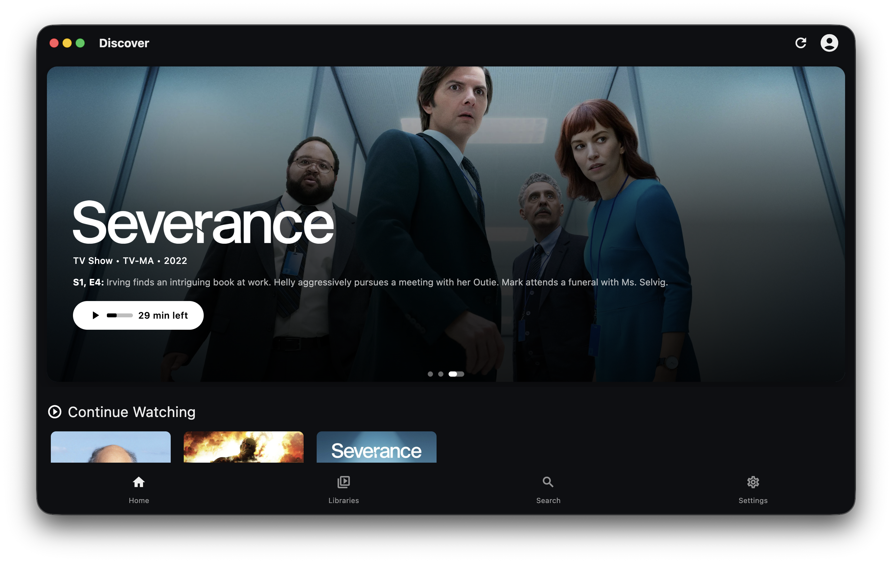

<h1>
  
  Plezy
</h1>

Plezy is a modern Plex media client that provides a seamless streaming experience across desktop and mobile platforms. Built with Flutter, it offers native performance and a clean, intuitive interface for browsing and playing your Plex media library.

<p align="center">
  
</p>

*See more screenshots in the [screenshots folder](assets/screenshots/#readme)*

## Download

### Mobile
<a href='https://apps.apple.com/us/app/id6754315964'></a>
<a href='https://play.google.com/store/apps/details?id=com.edde746.plezy'></a>

> Google Play version is in closed testing ([required by Google](https://support.google.com/googleplay/android-developer/answer/14151465#overview)). Join the [Google Group](https://groups.google.com/g/plezy-testers-2) to get access.

### Desktop
- [Windows (x64)](https://github.com/edde746/plezy/releases/latest/download/plezy-windows-installer.exe)
- [macOS (Universal)](https://github.com/edde746/plezy/releases/latest/download/plezy-macos.zip)
- [Linux (x64)](https://github.com/edde746/plezy/releases/latest/download/plezy-linux.tar.gz)

> Download the latest release from the [Releases page](https://github.com/edde746/plezy/releases)

## Features

### 🔐 Authentication & Server Management
- Sign in with Plex
- Automatic server discovery with smart connection selection
- Persistent sessions with auto-login

### 📚 Media Browsing
- Browse libraries with rich metadata
- Discover featured content
- Advanced search across all media
- Season and episode navigation

### 🎬 Video Playback
- Wide codec support including HEVC, AV1, VP9, and more
- Advanced subtitle rendering with full ASS/SSA support
- Audio and subtitle track selection with user profile preferences
- Playback progress sync and resume functionality
- Auto-play next episode

## Prerequisites

- Flutter SDK 3.8.1 or higher
- A Plex account
- Access to a Plex Media Server (local or remote)

## Installation

1. Clone the repository:
```bash
git clone https://github.com/edde746/plezy.git
cd plezy
```

2. Install dependencies:
```bash
flutter pub get
```

3. Generate required code:
```bash
dart run build_runner build
```

4. Run the application:
```bash
flutter run
```

## Development

### Code Quality

Before submitting changes, ensure your code passes all quality checks:

```bash
# Format code (including generated files)
dart format .

# Analyze code for issues
flutter analyze

# Run tests (if available)
flutter test
```

**Note**: CI checks exclude generated files (`.g.dart`, `.freezed.dart`) from formatting and analysis checks. You can run `dart format .` locally to format everything, but only your hand-written code will be validated in CI.

These checks are automatically run in CI for all pull requests.

### Code Generation

The project uses code generation for JSON serialization. After modifying model classes, run:

```bash
dart run build_runner build --delete-conflicting-outputs
```

## Building for Production

### Android
```bash
flutter build apk --release
# or
flutter build appbundle --release
```

### Desktop
```bash
flutter build macos --release
flutter build windows --release
flutter build linux --release
```

## Acknowledgments

- Built with [Flutter](https://flutter.dev)
- Media playback powered by [MediaKit](https://github.com/media-kit/media-kit)
- Designed for [Plex Media Server](https://www.plex.tv)
