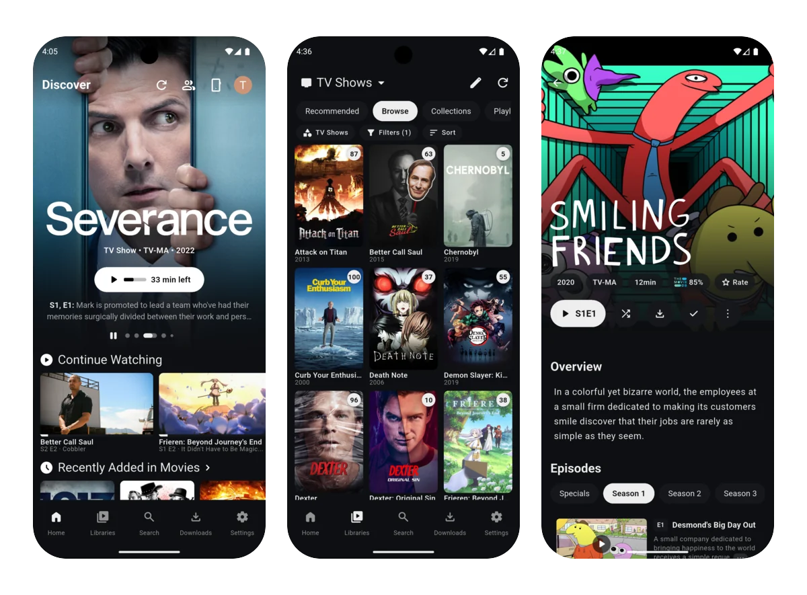

<h1>
  
  Plezy
</h1>

A modern client for Plex, Jellyfin, and Emby on desktop, mobile, and TV. Built with Flutter for native performance and a clean interface.

<p>
  <a href="https://plezy.app">Website</a> ·
  <a href="https://plezy.app/#screenshots">Screenshots</a> ·
  <a href="#download">Download</a> ·
  <a href="CONTRIBUTING.md">Contributing</a> ·
  <a href="LICENSE">License</a>
</p>

<p align="center">
  
</p>

## Download

<a href='https://apps.apple.com/app/apple-store/id6754315964?pt=128238902&ct=GitHub&mt=8'></a>
<a href='https://play.google.com/store/apps/details?id=com.edde746.plezy&referrer=utm_source%3Dgithub%26utm_campaign%3Dreadme_badge'></a>
<a href='https://www.amazon.com/gp/product/B0GK65CVS1'></a>
<a href='https://get.microsoft.com/installer/download/9n5r1s1t68h7?referrer=appbadge&cid=github'></a>

| Platform | Download |
| --- | --- |
| macOS | [DMG (x64, arm64)](https://github.com/edde746/plezy/releases/latest/download/plezy-macos.dmg) |
| Linux x64 | [.deb](https://github.com/edde746/plezy/releases/latest/download/plezy-linux-x64.deb) · [.rpm](https://github.com/edde746/plezy/releases/latest/download/plezy-linux-x64.rpm) · [.pkg.tar.zst](https://github.com/edde746/plezy/releases/latest/download/plezy-linux-x64.pkg.tar.zst) · [.flatpak](https://github.com/edde746/plezy/releases/latest/download/plezy-linux-x64.flatpak) · [portable tar.gz](https://github.com/edde746/plezy/releases/latest/download/plezy-linux-x64.tar.gz) |
| Linux arm64 | [.deb](https://github.com/edde746/plezy/releases/latest/download/plezy-linux-arm64.deb) · [.rpm](https://github.com/edde746/plezy/releases/latest/download/plezy-linux-arm64.rpm) · [.pkg.tar.zst](https://github.com/edde746/plezy/releases/latest/download/plezy-linux-arm64.pkg.tar.zst) · [.flatpak](https://github.com/edde746/plezy/releases/latest/download/plezy-linux-arm64.flatpak) · [portable tar.gz](https://github.com/edde746/plezy/releases/latest/download/plezy-linux-arm64.tar.gz) |

<details>
<summary>Install with a package manager</summary>

### macOS — Homebrew

```bash
brew tap edde746/plezy https://github.com/edde746/plezy
brew install --cask plezy
```

### Windows — WinGet

```bash
winget install edde746.Plezy
```

### Linux — Flatpak

Plezy's `.flatpak` downloads are self-distributed release bundles, not a Flathub listing. Flathub supplies the Freedesktop runtime only. Install Flatpak using your distribution's package manager, download the bundle for your architecture above, then run:

```bash
flatpak remote-add --user --if-not-exists flathub https://flathub.org/repo/flathub.flatpakrepo
flatpak install --user flathub org.freedesktop.Platform//25.08
flatpak install --user ./plezy-linux-x64.flatpak
flatpak run com.edde746.plezy
```

On arm64, replace `plezy-linux-x64.flatpak` with `plezy-linux-arm64.flatpak`. The runtime installation defaults to your host architecture.

Video playback requires a Wayland session, as in the native Linux release. A pure X11 session can display the interface but cannot create the video plane.

The sandbox does not request broad host or home filesystem access. App data is isolated under `~/.var/app/com.edde746.plezy/`, separate from a native installation.

Select custom host folders through the desktop file chooser portal; download folders must be writable. Existing or imported host paths are not automatically accessible inside the sandbox. Folder selection requires a working `xdg-desktop-portal` service and a compatible desktop backend.

Network, display, audio, and device access are enabled for streaming, hardware decoding, and evdev gamepads. Device access uses `--device=all` for compatibility with Flatpak 1.14; that permission exposes more than just GPUs and controllers. Session-bus access stays filtered, with one MPRIS name and narrow runtime paths for media artwork and Discord integration.

### Arch Linux — Pacman

[Distribution package](https://archlinux.org/packages/extra/x86_64/plezy/).

```bash
sudo pacman -S plezy
```

### Fedora / Red Hat — DNF

[Installation instructions](https://github.com/aldobarr/plezy-rpm) · Community repository by [@aldobarr](https://github.com/aldobarr).

### Nix

[Community package](https://search.nixos.org/packages?channel=unstable&query=plezy) maintained by [@mio-19](https://github.com/mio-19) and [@MiniHarinn](https://github.com/MiniHarinn).

### aerynOS — Moss

[Distribution package](https://github.com/aerynOS/recipes/tree/main/p/plezy).

```bash
sudo moss it plezy
```

</details>

## Features

###  Browse & Discover
- Libraries, collections, and playlists — video and audio
- Discover hub — Continue Watching, Next Up, trending, and recommendations
- Cross-server search across every connected Plex, Jellyfin, and Emby server
- Filtering, sorting, and alphabetical jump navigation
- Folder browsing and folder playback — home-video libraries open in folder view
- Resolution, HDR/Dolby Vision, and audio-format badges on cards and detail pages
- Favorites and unwatched library filters[^mb]
- Extras — trailers, deleted scenes, behind-the-scenes

###  Explore & Requests
- Explore tab — watchlist, trending, popular, and recommendation rows from Plex Discover[^plex], Trakt, MyAnimeList, AniList, Simkl, and Seerr[^connect]
- Search any connected catalog source
- Catalog titles matched back to your own libraries by external ID
- Seerr — request movies and shows with per-season, 4K, and advanced destination options, and see request status inline
- Watchlist sync — add and remove titles on Plex, Trakt, MyAnimeList, AniList, and Simkl from anywhere in the app

###  Playback
- Wide codec support (HEVC, AV1, VP9, and more)
- HDR and Dolby Vision[^hdr]
- Direct play, or transcode presets from 240p/320 kbps to 1080p/20 Mbps
- Multi-version switching with per-version file details
- Full ASS/SSA subtitles with customizable styling
- Online subtitle search & download[^plex]
- Audio & subtitle choices remembered per title, or follow the server's per-episode selections
- Progress sync and resume
- Auto-play next episode with skip intro / skip credits
- Chapter navigation with thumbnail scrub previews
- Playback speed from 0.25x to 8x, audio sync offset, sleep timer (fixed durations or end of video)
- Video zoom 50-200% with pinch, presets, and hotkeys
- Audio passthrough[^pass], stereo downmix with center-channel boost, and loudness normalization
- File Info sheet — every version, file, and stream the server reports
- Ambient lighting and GLSL shader presets[^mpv]
- Picture-in-Picture[^pip]
- Refresh-rate matching[^rrm]
- External player launch (VLC, MX Player, etc.) with progress sync back[^android]

###  Music
- Music libraries — artist, album, and track browsing with square artwork
- Album and artist screens with play, shuffle, and Instant Mix
- Gapless playback with a full play queue — reorder, remove, play next, add to queue
- Now Playing with synced lyrics[^lyrics], persistent mini-player, and sleep timer
- Background playback with lock-screen, media-key, and notification controls[^bgaudio]
- Offline playback of downloaded albums and tracks
- Streaming quality presets — Original, 320, 192, or 128 kbps

###  Live TV & DVR
- Live TV channel browsing, tuning, and favorites
- EPG guide with What's On and per-show schedules
- DVR recording rules, scheduled recordings, and a rememberable recording target library[^plex]
- Multi-server Live TV support where available

###  Downloads & Offline
- Download movies, shows, and music for offline playback[^dl]
- Background queue with pause / resume
- Sync rules for automatic downloads, with per-show "Include Specials"
- Offline browsing with watch state sync-back on reconnect

###  Watch Together
- Synchronized playback with friends
- Real-time play / pause / seek sync
- Host handoff when the relay and every connected peer support safe transfers
- Automatic reconnect authenticates retained room membership; it never silently joins a reused room code.

Self-hosted relays must support `authenticatedResume` for recovery. Deploy the updated relay before updating clients.
Older relays still accept explicit create/join, but failed recovery requires joining or creating a room again.

###  Integrations
- Discord Rich Presence[^desktop]
- Trakt, MyAnimeList, AniList, and Simkl — ratings, watched sync, and real-time scrobbling[^rt]
- Plezy Remote — control desktop and TV from mobile
- Watch Next row and tvOS Top Shelf[^shelf]

###  Platform & Customization
- Desktop, mobile, and TV — full D-pad, keyboard, and gamepad support
- Multiple servers at once — Plex, Jellyfin, and Emby side by side
- Profiles with per-profile downloads, watch state, and settings; Plex Home switching with PIN
- Jellyfin and Emby local-server discovery and multiple URLs per server; Quick Connect sign-in[^jf]
- TV layout options — corner spotlight backdrop, full-card artwork, and Force TV mode on desktop
- Customizable keyboard shortcuts[^desktop]
- Metadata and artwork editing
- Settings import/export
- Localized in English plus 21 translations

[^jf]: Jellyfin only.
[^mb]: Jellyfin and Emby only.
[^plex]: Plex only.
[^connect]: Requires connecting the service under Settings > Services.
[^hdr]: In-app HDR toggle on Windows, macOS, iOS, tvOS, and Linux — Linux needs a colour-managed Wayland compositor. Dolby Vision on Android and Apple TV.
[^pass]: Desktop, Android TV, and Apple TV.
[^mpv]: Requires the mpv player backend — unavailable on iOS and tvOS, and Android defaults to ExoPlayer.
[^pip]: Android, iOS, and macOS — not on Android TV or Apple TV.
[^rrm]: Windows, Android, and tvOS.
[^android]: Progress sync on Android.
[^lyrics]: Where your server provides lyrics.
[^bgaudio]: tvOS pauses music when the app is backgrounded.
[^dl]: Not available on tvOS.
[^desktop]: Desktop only.
[^rt]: Real-time scrobbling on Trakt and Simkl; MyAnimeList and AniList update on completion.
[^shelf]: Android TV / Fire TV and tvOS.

## Building from Source

### Prerequisites
- Flutter SDK 3.47.0+
- A Plex account, or a Jellyfin or Emby server with user credentials

### Setup

```bash
git clone https://github.com/edde746/plezy.git
cd plezy
flutter pub get
scripts/codegen.sh
flutter run
```

### Code Generation

After modifying model classes or other generated sources:

```bash
scripts/codegen.sh
```

After modifying translations:

```bash
dart run slang
```

### Building a Flatpak package

Run on Linux, preferably on the same architecture as the bundle. This packages an **already fully resolved Linux release bundle**, including the pinned libmpv and its bundled libraries; it is not a Flathub source-build manifest. Follow the bundle preparation steps in [the Linux release workflow](.github/workflows/build.yml) first: `flutter build linux` alone does not produce all the required bundled libraries.

Install the packaging tools (Debian/Ubuntu shown) and the native-architecture SDK and runtime in your user installation:

```bash
sudo apt-get update
sudo apt-get install -y flatpak flatpak-builder imagemagick
flatpak remote-add --user --if-not-exists flathub https://flathub.org/repo/flathub.flatpakrepo
flatpak install --user flathub org.freedesktop.Platform//25.08 org.freedesktop.Sdk//25.08

BUNDLE_DIR=build/linux/x64/release/bundle
python3 linux/packaging/build-flatpak.py --bundle "$BUNDLE_DIR" --arch x64 --output "$PWD"
```

For arm64, use the prepared arm64 bundle directory and `--arch arm64` on an arm64 host. The output is `plezy-linux-x64.flatpak` or `plezy-linux-arm64.flatpak`, respectively. Package from the checkout matching the bundle: the package version comes from `pubspec.yaml`. Install the result with the Flatpak commands above.

Cross-architecture packaging requires native Flatpak tools, a registered binfmt interpreter, and the target SDK/runtime installed with `flatpak install --user --arch=x86_64` (or `aarch64`). Do not run Flatpak's namespace tools themselves under emulation. Pass `--arch x64` or `--arch arm64` to the checker below, and the corresponding Flatpak architecture to `flatpak run --arch=...`.

Check the installed package against the runtime (not just the SDK):

```bash
python3 linux/packaging/check-flatpak.py
```

This checks executable permissions and every bundled ELF dependency. Also launch the installed app on a Wayland desktop and exercise streaming, audio, downloads/offline playback, and file chooser portals. A container without a GPU can use `flatpak run --env=GALLIUM_DRIVER=softpipe com.edde746.plezy` for software-rendered verification; this is not a hardware-decoding or HDR test.

### Local Checks

```bash
scripts/ci_checks.sh
```

To install the same pre-commit checks locally:

```bash
scripts/setup_hooks.sh
```

End-to-end tests (Android emulator plus a Dockerized Jellyfin fixture):

```bash
python3 scripts/maestro/run_maestro.py basic
```

## Contributing

See [CONTRIBUTING.md](CONTRIBUTING.md) for development workflow, formatting, tests, and translation guidelines.

## License

Plezy is licensed under [GPL-3.0](LICENSE).

## Acknowledgments

- Built with [Flutter](https://flutter.dev)
- Supports [Plex Media Server](https://www.plex.tv), [Jellyfin](https://jellyfin.org), and [Emby](https://emby.media)
- Playback powered by [mpv](https://mpv.io) via our [mpv-build](https://github.com/edde746/mpv-build) pipeline (started as a fork of [MPVKit](https://github.com/mpvkit/MPVKit); the Android Kotlin/JNI glue descends from [libmpv-android](https://github.com/jarnedemeulemeester/libmpv-android)), Android [ExoPlayer](https://developer.android.com/media/media3/exoplayer), and [libass-android](https://github.com/peerless2012/libass-android)
